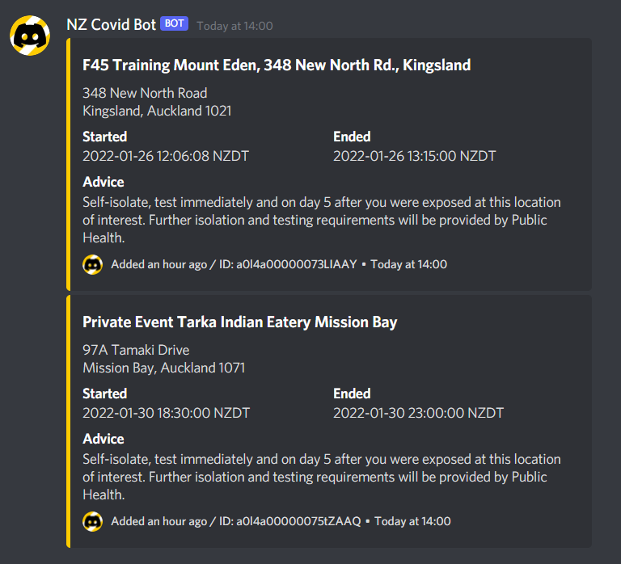
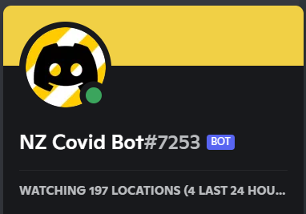
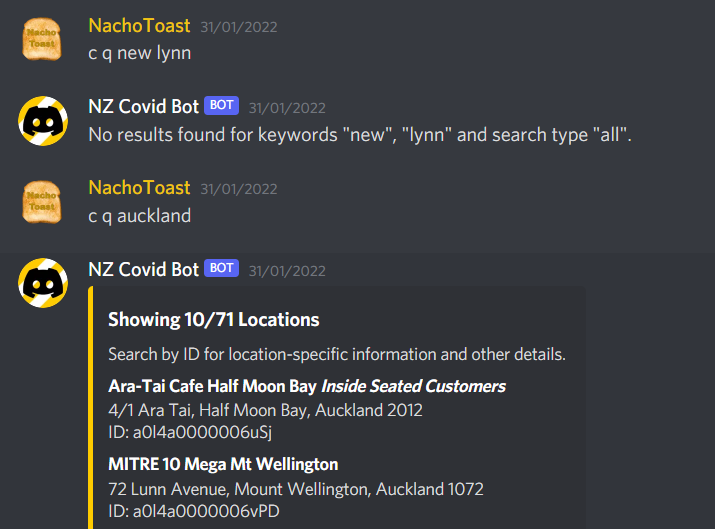
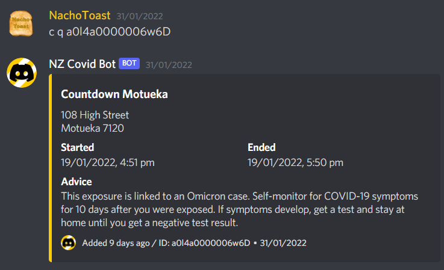

# NZ Covid Bot

A Discord bot that routinely checks for new Covid-19 locations in New Zealand, and announces them to a channel. You can also search for locations, and get information like the locations timeframe and advice for isolation and testing.

NZ Covid bot was a small project I started a while after Covid-19 arrived at New Zealand. Development of NZ Covid bot has since stopped due to less interest in locations and me moving onto other projects, but I view this bot was an important stepping stone.

